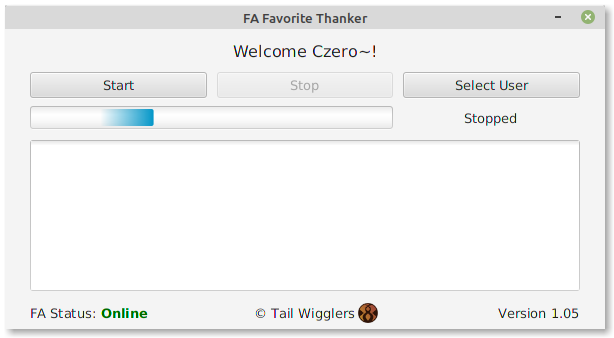

# FavThanker

This is an application used to automate thanking people for favorites on Furaffinity.

## Specifications

- Java 11
- JavaFX 11
- HtmlUnit

## System Requirements

- Windows, MacOS, Linux
- Java installed
- Must use the FA 'Modern' theme

## Installation

### Windows

- Download the Windows `.jar` file from the [latest release](https://github.com/TailWigglers/FavThanker/releases/latest).
- Create a folder named `FavThanker` somewhere on your computer.
- Cut and paste the `.jar` file into the `FavThanker` folder.
- Run the application by double clicking the `.jar` file.
   - Alternatively, open cmd, `cd` into the `FavThanker` folder and run `java -jar FavThanker-windows.jar`.
   
### MacOS

- Download the Mac `.jar` file from the [latest release](https://github.com/TailWigglers/FavThanker/releases/latest).
- Create a folder named `FavThanker` somewhere on your computer.
- Cut and paste the `.jar` file into the `FavThanker` folder.
- Run the application by double clicking the `.jar` file. If a security dialog appears, click `Cancel`, then inside settings, open `Security & Privacy` and run the application anyways.
   - Alternatively, open a terminal, `cd` into the `FavThanker` folder and run `java -jar FavThanker-mac.jar`.

### Linux

- Download the Linux `.jar` file from the [latest release](https://github.com/TailWigglers/FavThanker/releases/latest).
- Create a folder named `FavThanker` somewhere on your computer.
- Cut and paste the `.jar` file into the `FavThanker` folder.
- Run the application by double clicking the `.jar` file.
   - Alternatively, open a terminal, `cd` into the `FavThanker` folder and run `java -jar FavThanker-linux.jar`.

## Usage

- Download and edit the [JSON template](https://raw.githubusercontent.com/TailWigglers/FavThanker/master/package/Template.json).
   - Fill in your FA username.
   - Add pre-made messages to the message array.
   - Add groups for sending specific messages to specific groups of users.
   - Rename the file to your username (for example `Seledrex.json`).
- Cut and paste the JSON file into the `FavThanker` folder.
- Run the `.jar` file.
- Press `Select User` and select the JSON file.
- Add `Cookie A` and `Cookie B` into the text fields.
   - To view your cookies on Chrome, follow these [instructions](https://developers.google.com/web/tools/chrome-devtools/storage/cookies). Other browsers will have similar methods.
   - When viewing FA, there should be two cookies, one named `a` and the other `b`. You just need the corresponding values for these for the FavThanker application to work.
- Press start to begin thanking.

## Notes

- Favorite notifications will be automatically removed from your FA.
- Favorite notifications and shouts will be saved in CSV format in the application folder.
- Cookies are saved to the application folder so the user will stay logged in.
- The application will not leave a shout on user pages where the user has left a shout in their own shout box.
- Shouts are made every 20 seconds to avoid FA spam warnings.

## Compiling

`mvn clean compile assembly:single`

## Todo

- Better packaging
- Command line version
- Create config file within the application
- Add exclude list
